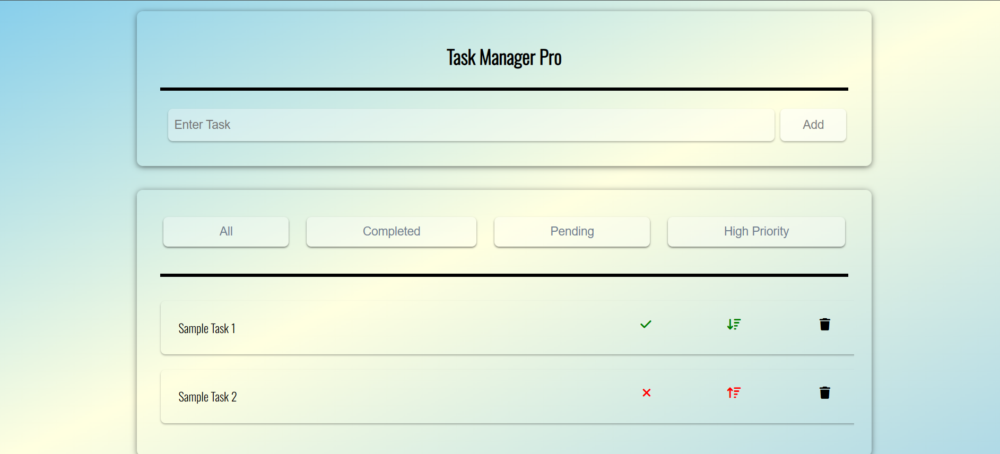

# 🗂️ Task Manager Pro

A powerful and simple task management web application built using HTML, CSS, and JavaScript. This app helps users create, manage, prioritize, and filter their daily tasks — with data saved in the browser using Local Storage.

---

## 🚀 Features

- ✅ Add and delete tasks easily  
- 📌 Mark tasks as completed or pending  
- 🔼 Set high or low priority  
- 🔍 Filter tasks: All | Completed | Pending | High Priority  
- 💾 Data saved in Local Storage — stays even after refresh!

---

## 🔧 Tech Stack

- HTML5  
- CSS3  
- JavaScript (Vanilla)  
- Font Awesome (for icons)  
- Local Storage API

---

## 📸 Screenshot

---

## 🎥 Demo Video

---

## 📂 Folder Structure

Task-Manager-Pro/
│
├── index.html
├── index.css
├── index.js
├── README.md
└── screenshots/
    └── taskmanager.png
    └── demo.mp4

---

## 🧠 How It Works

- **Tasks are saved** in the browser’s local storage as an array of objects.
- Each task contains:
  - `name` (text)
  - `status` (true/false)
  - `priority` (true/false)
- When users interact (add/delete/status/priority), the list is updated in both UI and storage.

---

## 📌 How to Use

1. Type a task in the input box  
2. Click **Add** to save it  
3. Use ✔️ or ❌ to toggle completion  
4. Use 🔺 or 🔻 to mark priority  
5. Use 🗑️ to delete tasks  
6. Click filter buttons to see filtered results

---

## 👨‍💻 Author

**Balaji S.K**  
Aspiring Full Stack Developer | Focused on clean UI + functional JS  
[GitHub Profile](https://github.com/Balaji-keh06)

---

## 🌟 Show Your Support

If you liked this project, consider giving it a ⭐ on GitHub and sharing it with others!
